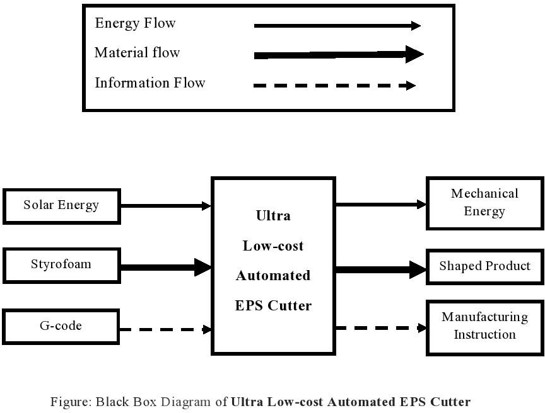
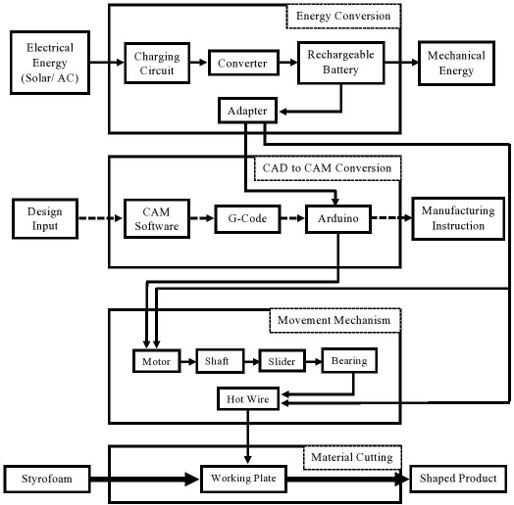
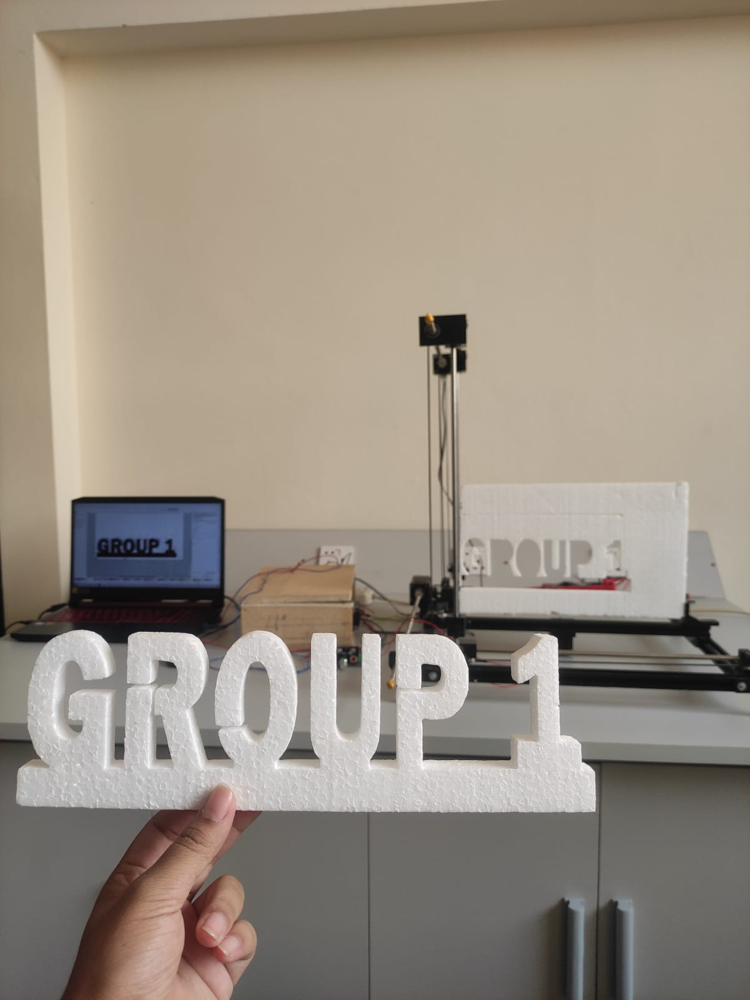

# Automated CNC Hot-Wire EPS Cutter

An engineering portfolio documenting the structured design, development, and physical prototyping of a low-cost automated hot-wire machine for cutting expanded polystyrene (EPS).

## Portfolio Highlights

| Engineering area | Evidence |
| --- | --- |
| Product concept | CNC hot-wire EPS cutting system |
| Customer requirements | Quality Function Deployment and House of Quality |
| System design | Functional decomposition and component architecture |
| Design development | Complete CAD assembly render |
| Decision methods | Weighted material and manufacturing-process selection |
| Physical evidence | Constructed prototype and finished EPS lettering |
| Recognition | Second Place, IEOM Undergraduate Student Paper Competition |

## Engineering Challenge

Manual foam cutting can require considerable skill and effort to achieve repeatable, intricate shapes. The project explored a CNC-based hot-wire approach intended to improve automation, cutting consistency, safety, and ease of operation while maintaining a low-cost design objective.

## Engineering Workflow

1. Identify and prioritise user needs.
2. Translate customer requirements into technical characteristics through Quality Function Deployment.
3. Decompose the product into functional and component architectures.
4. Develop the machine arrangement and complete assembly in CAD.
5. Select materials and manufacturing processes using weighted decision methods.
6. Construct a physical prototype and demonstrate a finished EPS cutting output.

<p align="center">
  
</p>
<p align="center"><em>Quality Function Deployment connected customer priorities with engineering design characteristics.</em></p>

## System Architecture

The design was decomposed into energy, material, and information flows. The diagrams define the system boundary and show how the body, movement, energy-conversion, CAD-to-CAM, control, and cutting functions interact.

<p align="center">
  
</p>
<p align="center"><em>The black-box model defines the principal system inputs, transformation, and outputs.</em></p>

<p align="center">
  
</p>
<p align="center"><em>The component hierarchy groups the major machine subsystems and their supporting elements.</em></p>

<p align="center">
  
</p>
<p align="center"><em>The functional structure connects energy conversion, control, movement, and material cutting.</em></p>

## CAD Assembly

The CAD assembly communicates the proposed frame, movement arrangement, work area, and hot-wire cutting configuration. It served as the primary design model before construction of the physical prototype.

<p align="center">
  
</p>
<p align="center"><em>Complete CAD assembly of the automated EPS cutter concept.</em></p>

## Physical Prototype and Cutting Output

A physical prototype was constructed to demonstrate the proposed machine architecture. The finished-output photograph records EPS lettering produced using the prototype.

<p align="center">
  
</p>
<p align="center"><em>Finished EPS lettering produced during prototype operation.</em></p>

Supporting evidence:

- [Physical prototype photograph](assets/images/prototype/eps-cutter-physical-prototype.jpeg) — pending final consent and privacy review
- [Prototype demonstration video](assets/videos/eps-cutter-prototype-demonstration.mp4) — pending final privacy and audio review

The video is linked as supporting evidence and does not play automatically.

## Engineering Methods

- Customer-needs analysis and prioritisation
- Quality Function Deployment
- Functional decomposition
- Component architecture
- CAD-based design communication
- Weighted material selection
- Weighted manufacturing-process selection
- Physical prototyping
- Team-based engineering development

The documented material decisions include aluminium for the body frame and nichrome wire for the cutting element. The manufacturing study considered body-frame production, joining, finishing, and colouring alternatives.

## Project Outcomes

- Developed a structured system architecture for the automated cutter concept
- Translated customer requirements into engineering characteristics
- Produced a complete CAD assembly
- Selected materials and manufacturing processes through comparative methods
- Constructed a physical prototype
- Demonstrated a finished EPS lettering output
- Documented the work through an associated conference publication
- Received Second Place in the IEOM Undergraduate Student Paper Competition

## Engineering Evidence

- Original CAD render
- System black-box diagram
- Component hierarchy
- Functional structure
- House of Quality
- Prototype and finished-output photographs
- Prototype demonstration video
- Original team product-design report
- Award certificate
- Research bibliography

## Documentation

- [Original team product-design report](documentation/eps-cutter-product-design-report.pdf) — redistribution rights remain under review
- [IEOM award certificate](documentation/ieom-undergraduate-paper-award-certificate.pdf)
- [Research references](publication/research-references.md)

## Publication

**Paper:** Effect of Cutting Parameters on Performance of CNC Hot Wire Styrofoam Cutting Machine

**Conference:** 7th Bangladesh Conference on Industrial Engineering and Operations Management (IEOM)

**Year:** 2024

**DOI:** [10.46254/BA07.20240050](https://doi.org/10.46254/BA07.20240050)

The associated research examined how operating conditions affect the performance of a CNC hot-wire EPS cutting process. The work combined development of a low-cost machine concept with structured experimentation on the nichrome-wire cutting system. Current supply, wire-temperature behaviour, cutting time, kerf, surface condition, and wire stability were considered when comparing operating points. CAD modelling and functional decomposition established the machine architecture, while the physical prototype provided the platform for experimental observation. The analysis sought a practical balance between sufficient thermal energy for cutting and the adverse effects of excessive heating, including surface distortion and wire instability. Rather than treating speed as the only objective, the study considered cut quality and process consistency alongside operating time. This repository presents the underlying engineering workflow, original diagrams, CAD render, prototype evidence, and finished cutting output. Publication details are included for attribution, while the repository remains focused on the engineering work itself.

The publisher-formatted conference paper is not distributed in this repository.

Additional publication context is available in [`publication/CITATION.md`](publication/CITATION.md).

## Award

**Second Place**

IEOM Undergraduate Student Paper Competition

7th Bangladesh Conference on Industrial Engineering and Operations Management

[View the award certificate](documentation/ieom-undergraduate-paper-award-certificate.pdf).

## Repository Structure

```text
automated-eps-cutter/
├── README.md
├── .gitignore
├── assets/
│   ├── images/
│   │   ├── design/
│   │   │   ├── component-hierarchy.png
│   │   │   ├── eps-cutter-cad-assembly.png
│   │   │   ├── functional-structure-diagram.jpg
│   │   │   ├── house-of-quality.png
│   │   │   └── system-black-box-diagram.jpg
│   │   └── prototype/
│   │       ├── eps-cutter-physical-prototype.jpeg
│   │       └── eps-lettering-output.jpeg
│   └── videos/
│       └── eps-cutter-prototype-demonstration.mp4
├── documentation/
│   ├── eps-cutter-product-design-report.pdf
│   └── ieom-undergraduate-paper-award-certificate.pdf
└── publication/
    ├── CITATION.md
    └── research-references.md
```

## Limitations

- Exact cutting accuracy, machine dimensions, and detailed operating specifications were not independently verified from the available public evidence.
- The academic report retains its original project context and remains subject to final redistribution-rights review.
- The prototype photograph and demonstration video remain subject to final consent and privacy review.
- Cost and break-even values from the original academic work are not reproduced as validated portfolio claims.

## Project Team

- Md. Soad Solaiman
- Abdullah Al Jubair
- Ibrahim Kholil
- Md. Arifur Rahman
- Md. Rakibul Hassan
- Md. Sakibul Islam Sakib

This collaborative university project was completed by students from the Department of Industrial and Production Engineering at the Military Institute of Science and Technology.

## Citation

Use the publication title, conference, year, and DOI recorded in [`publication/CITATION.md`](publication/CITATION.md). The publisher-formatted conference paper is intentionally excluded.