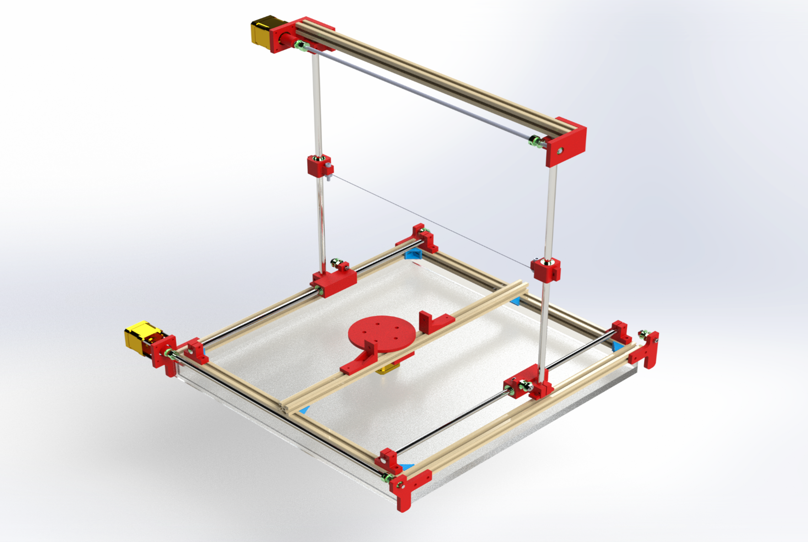
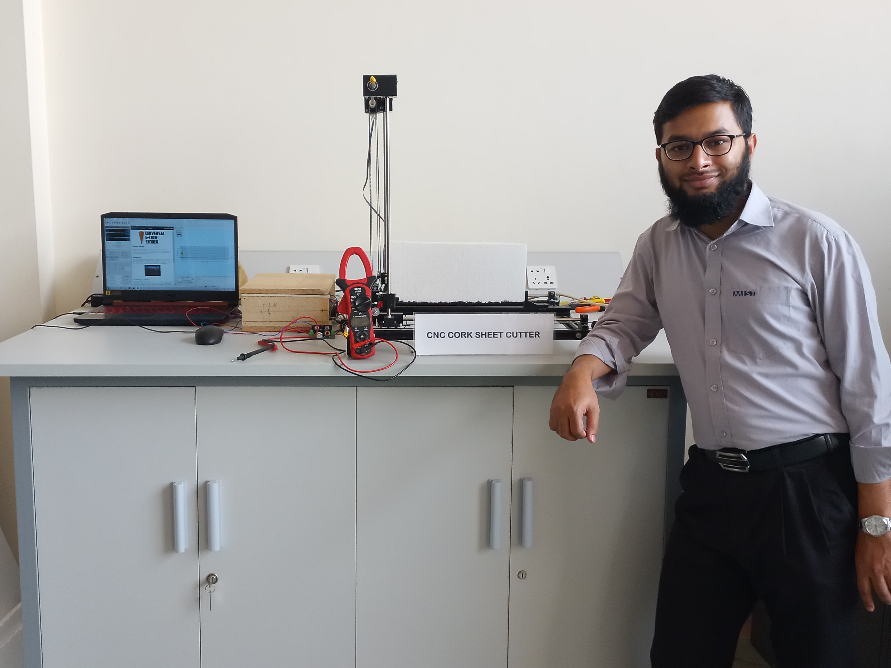
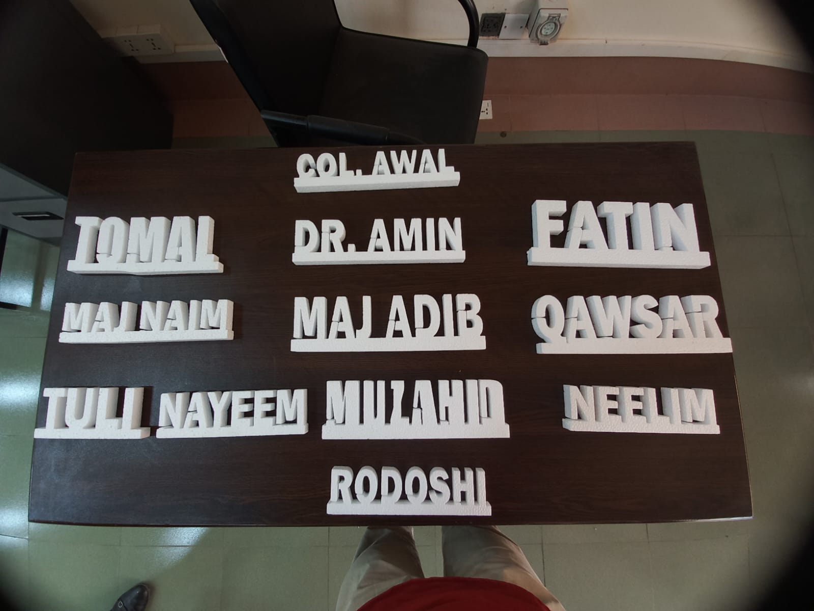
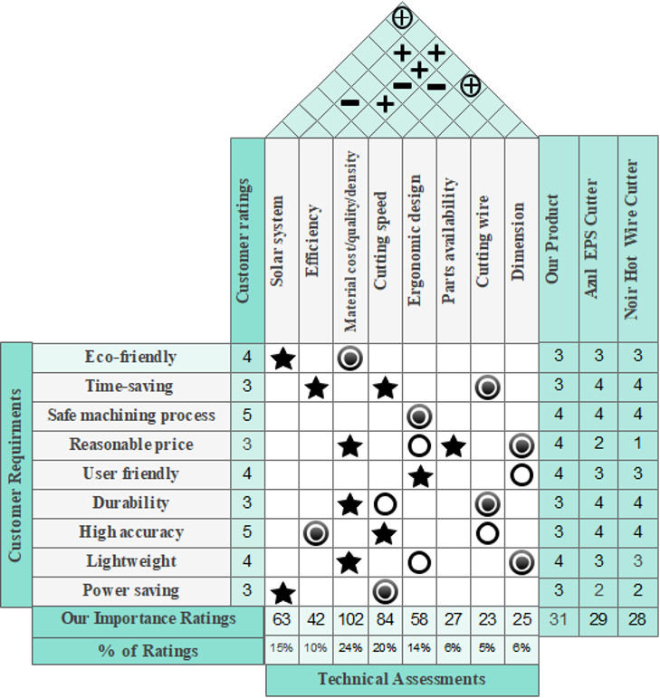
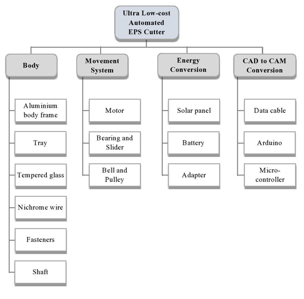

# Ultra Low-Cost Automated EPS Cutter

This university Product Design project focused on designing and prototyping a low-cost CNC hot-wire machine for cutting expanded polystyrene (EPS) foam. The work combined structured engineering design methods with the construction of a physical prototype.



## Project Overview

Manual foam cutting can require considerable skill and effort to produce accurate, intricate shapes. This project proposed an automated hot-wire cutter intended to make the process more affordable, accurate and efficient while reducing manual effort.

The project covered both product-design methodology and physical prototyping. It progressed from customer research and technical-requirement development through functional analysis, CAD communication, material and manufacturing-process selection, cost analysis and prototype construction.

## Key Project Objectives

- Develop a low-cost automated approach to cutting EPS foam with a hot wire.
- Support intricate cutting through a CNC-based process.
- Improve cutting accuracy and reduce the manual effort associated with foam cutting.
- Consider affordability, safety, usability, durability, weight and energy use during design development.
- Apply structured product-design methods to material, process and cost decisions.
- Construct a physical prototype to communicate and evaluate the design concept.

## Prototype



A physical prototype was constructed as part of the project. It demonstrates the implementation of the proposed cutter architecture without implying performance values that were not experimentally verified in the available project material.

## Operational Demonstration

The completed prototype was used to produce custom EPS lettering using the hot-wire cutting mechanism. The photograph below shows one example of the finished EPS cut produced during prototype testing.



*Example of EPS lettering produced using the developed prototype.*

## Engineering Design Process

### Customer Needs Analysis

The team conducted a survey of 49 people using online forms, face-to-face interviews and phone interviews. The identified customer requirements included environmental consideration, time saving, safe operation, reasonable price, ease of use, durability, accuracy, low weight and power saving. These findings informed subsequent design priorities.

### Quality Function Deployment



Quality Function Deployment was used to translate customer requirements into technical characteristics. The House of Quality related user priorities to considerations such as material properties and cost, cutting speed, energy supply, ergonomic design, efficiency, dimensions, parts availability and cutting-wire selection.

### Functional Decomposition


*Black-box diagram — identifies the system's energy, material and information inputs and its corresponding outputs.*



*Component hierarchy — groups the proposed machine into body, movement, energy-conversion and CAD-to-CAM functions and their supporting components.*


*Functional structure — communicates how energy conversion, design-data processing, movement and material cutting interact within the proposed system.*

### CAD and Design Development


The CAD assembly render communicates the proposed machine architecture and component arrangement. It provides a consolidated view of the frame, movement system, work area and cutting-wire arrangement used during design development.

### Material Selection

The project used digital-logic and weighted-average methods to compare alternatives against selected criteria. The documented decisions included aluminium for the body frame and nichrome wire for the cutting element.

### Manufacturing Process Selection

Manufacturing-process selection was approached systematically by comparing alternatives for body-frame production, temporary and permanent joining, finishing and colouring. The analysis used weighted criteria to support process choices rather than relying only on informal preference.

### Cost and Break-Even Analysis

The project included analysis of fixed cost, variable cost, unit-related cost, selling price and break-even quantity. Exact figures are not reproduced here because this portfolio summary does not independently validate the assumptions and internal consistency of the original academic calculations.

## Demonstration

[Watch the prototype demonstration](media/prototype-demonstration.mp4)

## Project Deliverables

- [Product design report](docs/product-design-report.pdf)
- [Product design presentation](docs/product-design-presentation.pptx)

## Skills Demonstrated

- Product design
- Customer-needs analysis
- Quality Function Deployment
- Functional decomposition
- CAD-based design communication
- Material selection
- Manufacturing-process selection
- Cost analysis
- Break-even analysis
- Physical prototyping
- Engineering teamwork

## Supporting Research

The `reference-material/research-papers/` directory contains academic papers reviewed during the project's literature and technical research.

[Browse the supporting research papers](reference-material/research-papers/)

## Team

This was a group university project completed by students from the Department of Industrial and Production Engineering at the Military Institute of Science and Technology.

Team members:

- Abdullah Al Jubair
- Ibrahim Kholil
- Md. Arifur Rahman
- Md. Rakibul Hassan
- Md. Sakibul Islam Sakib
- Md. Soad Solaiman

**Role: Team Lead — Md. Soad Solaiman**

The design, analysis and prototype were outcomes of the group's collaborative work; they are not presented as the work of one individual.

## Repository Structure

```text
automated-eps-cutter/
├── README.md
├── docs/
│   ├── product-design-report.pdf
│   └── product-design-presentation.pptx
├── images/
│   ├── black-box-diagram.jpg
│   ├── component-hierarchy.png
│   ├── eps-cutter-cad-assembly.png
│   ├── eps-cutter-finished-output.jpeg
│   ├── eps-cutter-prototype.jpeg
│   ├── eps-cutting-samples.jpeg
│   ├── functional-structure.jpg
│   └── house-of-quality.png
├── media/
│   └── prototype-demonstration.mp4
└── reference-material/
    ├── cutting-mechanisms-reference.png
    └── research-papers/
        └── supporting research papers
```

The `reference-material/` directory contains a supporting literature-review illustration and the academic papers reviewed during the project's research.

## Important Note

This repository presents an academic group project. The included report and presentation retain their original academic context, including the terminology, analysis and attribution used in the submitted project materials.

## Scope and Limitations

The following details were intentionally omitted because they were unsupported, uncertain or insufficiently validated in the available project materials:

- Exact cutting performance and accuracy
- Dimensions and detailed specifications
- Unverified software and hardware implementation claims
- Exact cost and break-even figures
- Commercial validation or industry-readiness claims
- Claims assigning the entire group project to one person
